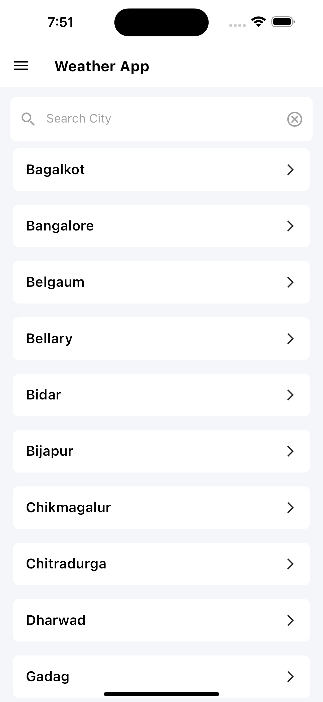
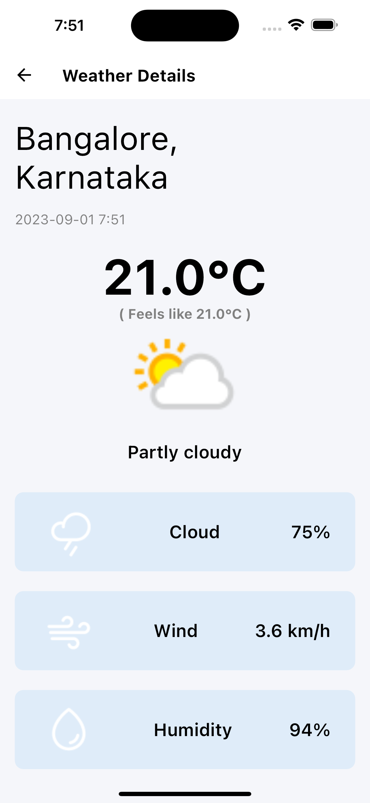

# Flutter Weather App

A simple weather app built using Flutter that fetches weather data from a public weather API and displays it to the user.

## Screenshots




## Features

- **Location Selection Screen:**
  - Users can input a city name or select a city from a predefined list.
  - After city selection navigating to the weather details screen.

- **Weather Display Screen:**
  -  Weather data is fetched from a public weather API based on the selected location.
  -  A loading indicator is displayed while fetching data.
  - Graceful error handling with appropriate error messages.
  - Displays city name, current temperature, weather condition, weather icon, min and max temperature, humidity, and wind speed.

## Getting Started

1. Clone this repository:

   ```bash
   git clone https://github.com/kvkarthik96/Weather-App
   ```

2. Navigate to the project directory:

   ```bash
   cd Weather-App
   ```

3. Install dependencies:

   ```bash
   flutter pub get
   ```

4. Run the app:

   ```bash
   flutter run
   ```

## Dependencies

- [http](https://pub.dev/packages/http): A package for making HTTP requests.
- [shimmer](https://pub.dev/packages/shimmer): A package provides an easy way to add shimmer effect in Flutter project.
- [flutter_bloc](https://pub.dev/packages/flutter_bloc): State management library for Flutter applications.
- [flutter_screenutil:](https://pub.dev/packages/flutter_screenutil): A flutter plugin for adapting screen and font size.
- [cached_network_image:](https://pub.dev/packages/cached_network_image): A flutter library to show images from the internet and keep them in the cache directory.


## API Used

- [OpenWeatherMap](https://www.weatherapi.com/): Used to fetch weather data.


